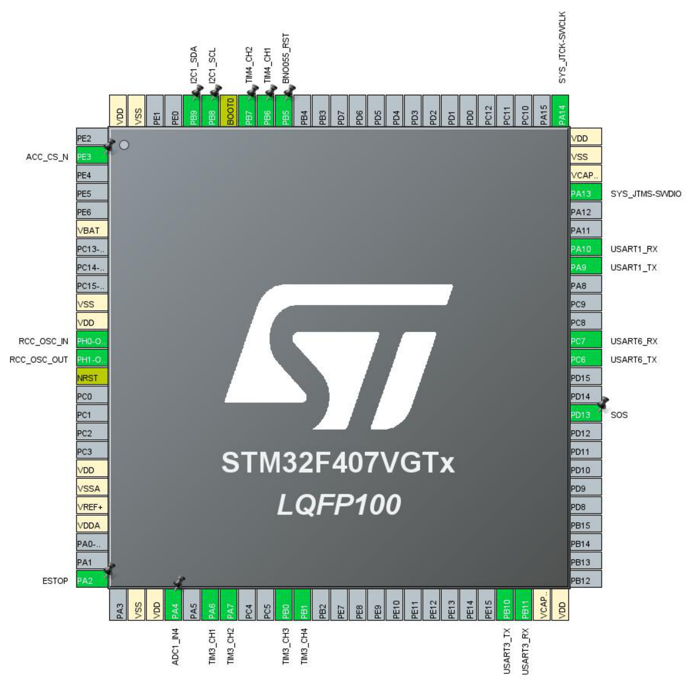

# RedgeSCUE — Firmware STM32F407

STM32 là lớp điều khiển thời gian thực của phao cứu hộ. Firmware nhận mục tiêu `NAV`
từ Raspberry Pi, đọc BNO055 / GPS / RC receiver, áp dụng watchdog an toàn, và chỉ sau
đó mới phát PWM tới ESC và servo.

- **MCU:** STM32F407VGTx, LQFP100 — board STM32F407G-Discovery
- **Toolchain:** CMake + Ninja + arm-none-eabi-gcc
- **Cấu hình:** STM32CubeMX 6.16.1, STM32Cube FW_F4 V1.28.3

---

## 1. Cấu trúc thư mục

```
STM32F4/
├── STM32F4.ioc            cấu hình CubeMX — NGUỒN SỰ THẬT cho pinout và clock
├── Core/                  code CubeMX sinh ra (main.c, gpio.c, i2c.c, tim.c, usart.c, adc.c)
├── Drivers/               CMSIS + STM32F4xx HAL
├── Modules/               mỗi thư mục con là MỘT ngoại vi / thiết bị
│   ├── Actuators/         ESC + servo qua TIM PWM
│   ├── BNO055/            driver IMU (I2C) + calibration profile
│   ├── GPS/               bộ phân tích NMEA
│   ├── IBUS/              bộ phân tích khung iBUS của FS-iA6B
│   └── PiLink/            mã hoá / giải mã khung với Raspberry Pi
├── App/                   tầng ứng dụng
│   ├── control.c/.h       vòng điều khiển + watchdog an toàn
│   ├── imu.c/.h           lớp đệm trên driver BNO055
│   └── app_config.h       ngưỡng, timeout, hằng số PWM
├── Tools/                 dump calibration, dashboard STM32CubeMonitor
├── docs/                  ảnh pinout
├── build.bat              cmake + ninja → build/Debug/STM32F4.elf
└── flash.bat              nạp qua ST-LINK
```

### Quy tắc phân tầng

```
main.c  →  App/  →  Modules/  →  HAL
```

- `main.c` **chỉ** gọi API của `App/`, không gọi thẳng vào `Modules/`.
- `App/` chứa logic và chính sách: khi nào arm, khi nào dừng, ngưỡng lật, điều khiển heading.
- `Modules/` chứa code nói chuyện với phần cứng. **Một module không được biết gì về tầng
  ứng dụng** — bê sang dự án khác phải chạy được ngay.

> **Ngoại lệ đang tồn tại:** `Modules/Actuators` và `Modules/PiLink` đang include
> `App/app_config.h` để lấy `ESC_*`, `SERVO_*`, `NAV_TIMEOUT_MS`. Đây là một mũi tên
> ngược chiều, chấp nhận được ở quy mô hiện tại. Muốn dọn sạch thì đưa hằng số phần cứng
> của từng module về chính thư mục module đó, chỉ giữ ngưỡng điều khiển ở `App/`.

`App/imu.c` là lớp đệm giữa driver BNO055 và vòng điều khiển: giữ struct `bno055_euler_t`
phẳng mà `control.c` mong đợi, và map `yaw` của cảm biến thành `heading_deg` của bộ điều
khiển. Nhờ vậy `Modules/BNO055/` vẫn là driver thuần.

---

## 2. Pinout



Chữ trên ảnh hơi mờ ở vài chân. **Bảng dưới đây và `STM32F4.ioc` mới là căn cứ**, ảnh
chỉ để nhìn tổng thể.

### Xuất lại ảnh khi đổi pinout

CubeMX **không có lệnh xuất sơ đồ chip ra file ảnh**. Menu `Pinout → Export pinout with /
without Alt. Functions` (`Ctrl+U`) chỉ ra **CSV danh sách chân**, không phải ảnh.

Cách lấy ảnh nét nhất là đi qua báo cáo PDF, vì sơ đồ trong đó là vector:

1. Trong CubeMX: **Project → Generate Reports** → sinh ra `STM32F4.pdf` và `STM32F4.txt`
2. Trang đầu PDF chứa sơ đồ pinout. Trích ra PNG ở DPI cao:

```
pdftoppm -png -r 200 -f 1 -l 1 STM32F4.pdf docs/pinout
```

3. Đổi tên file vừa sinh thành `docs/pinout.png`

Chụp màn hình cũng được nhưng chữ sẽ mờ như ảnh hiện tại. Nếu buộc phải chụp, phóng to
sơ đồ bằng `Ctrl` + con lăn chuột rồi mới chụp.

`STM32F4.txt` trong cùng báo cáo là bảng chân dạng văn bản, tiện để đối chiếu với bảng trên.

| Chức năng | Peripheral | Chân | Tham số | Nối tới |
|---|---|---|---|---|
| UART Raspberry Pi | USART1 | PA9 TX, PA10 RX | 115200 8N1, RX interrupt | Pi GPIO15/RXD0 ← PA9; Pi GPIO14/TXD0 → PA10 |
| GPS Holybro M10 V2 | USART3 | PB10 TX, PB11 RX | 9600 8N1, RX interrupt | GPS TX → PB11; GPS RX ← PB10 |
| RC receiver FS-iA6B | USART6 | PC6 TX, PC7 RX | 115200 8N1, RX interrupt | iBUS → PC7 |
| IMU BNO055 | I2C1 | PB8 SCL, PB9 SDA | Fast Mode 400 kHz | địa chỉ 0x29 (ADR thả nổi) |
| Reset BNO055 | GPIO_Output | PB5 | mức cao khi chạy | chân nRESET của module |
| ESC trái | TIM3_CH1 | PA6 | PWM 50 Hz, khởi tạo 1000 µs | chỉ dây signal + GND |
| ESC phải | TIM3_CH2 | PA7 | PWM 50 Hz, khởi tạo 1000 µs | chỉ dây signal + GND |
| ESC trước | TIM3_CH3 | PB0 | PWM 50 Hz, khởi tạo 1000 µs | chỉ dây signal + GND |
| Servo 1 | TIM3_CH4 | PB1 | PWM 50 Hz, khởi tạo 1500 µs | cấp nguồn servo độc lập |
| Servo 2 | TIM4_CH1 | PB6 | PWM 50 Hz, khởi tạo 1500 µs | cấp nguồn servo độc lập |
| Servo 3 | TIM4_CH2 | PB7 | PWM 50 Hz, khởi tạo 1500 µs | cấp nguồn servo độc lập |
| E-stop | GPIO_Input | PA2 | **pull-up**, tiếp điểm thường đóng | nút NC → GND |
| SOS / relay | GPIO_Output | PD13 | khởi tạo mức thấp | qua transistor, không nối tải trực tiếp |
| Chip select accelerometer | GPIO_Output | PE3 | **giữ mức cao** | không nối gì — xem mục 3 |
| Battery sense | ADC1_IN4 | PA4 | rank 1, 3 cycles — **chưa dùng trong code** | qua cầu chia áp |
| Debug | SWD | PA13 SWDIO, PA14 SWCLK | — | ST-LINK trên board (CN1) |
| Thạch anh | RCC | PH0, PH1 | khai báo sẵn, **chưa dùng** | xem mục 5 |

### Vì sao TIM3/TIM4 dùng prescaler 83 và period 19999

APB1 chạy 42 MHz, hệ số chia khác 1 nên **timer clock của APB1 là 84 MHz**:

```
84 MHz / (83 + 1)  = 1 MHz   →  1 tick = 1 µs
(19999 + 1) tick   = 20 ms   →  50 Hz
```

Giá trị compare vì vậy viết thẳng bằng micro-giây:
`__HAL_TIM_SET_COMPARE(&htim3, TIM_CHANNEL_1, 1500)` cho ra xung 1500 µs. Các hằng số
`ESC_STOP_US`, `SERVO_CENTER_US` trong `App/app_config.h` dùng trực tiếp, không phải quy đổi.

---

## 3. Ba ràng buộc của board Discovery

Board Discovery có sẵn cảm biến, codec âm thanh và cổng USB nối cứng vào một số chân.
Ba điều dưới đây là bắt buộc, không phải khuyến nghị.

**PE3 phải luôn ở mức cao.** Cảm biến gia tốc LIS3DSH trên board dùng chung SPI1 với
PA6/PA7, mà **PA6 là MISO — chân xuất của cảm biến**. Nếu PE3 (chip select) không được giữ
cao, cảm biến được chọn và sẽ đẩy tín hiệu chống lại PWM của TIM3_CH1, làm xung ESC trái
méo hoặc mất hẳn. `MX_GPIO_Init()` đặt PE3 lên cao trước khi timer chạy.
**Không bật SPI1 trong CubeMX.**

**Không cắm gì vào cổng USB OTG (CN5).** PA9/PA10 là VBUS và ID của cổng đó. Cắm thiết bị
vào là 5 V trên VBUS chống lại chân USART1_TX. Chỉ dùng CN1 (ST-LINK) để nạp và cấp nguồn.

**PB9 đã có điện trở pull-up sẵn, PB8 thì không.** PB6/PB9 là bus I2C của codec CS43L22
trên board nên PB9 được pull-up sẵn. Codec nằm cùng bus ở địa chỉ 0x4A, bị giữ reset bởi
PD4 nên không quấy bus. Module GY-BNO055 thường có pull-up riêng nên thường vẫn chạy;
nếu `BNO055_Init()` trả `ERR_I2C` thì gắn 4.7 kΩ từ **PB8 lên 3.3 V** là thứ đáng thử đầu
tiên. **Không bật I2S2/I2S3** vì PC7 và PB10 dính vào codec và micro MEMS.

---

## 4. E-stop: bắt buộc đấu thường đóng

PA2 bật pull-up nội và firmware coi **mức cao là E-stop tác động**. Nút phải là loại
**thường đóng (NC)** nối PA2 xuống GND:

| Tình huống | PA2 | Kết quả |
|---|---|---|
| Bình thường, tiếp điểm đóng | thấp | chạy |
| Nhấn nút, tiếp điểm mở | cao | dừng |
| **Đứt dây, tuột jack** | cao | **dừng** |

Đấu ngược lại (nút thường mở kéo lên 3.3 V) sẽ khiến dây đứt bị hiểu là "không nhấn" và
chân vịt vẫn quay — đúng cái mà E-stop sinh ra để chống.

Chưa có nút thì khi test tạm nối PA2 thẳng xuống GND bằng một sợi dây. Rút dây ra là mô
phỏng đứt dây, phải thấy trạng thái dừng.

---

## 5. Clock

Hiện chạy **HSI 16 MHz** → PLL (M=8, N=168, P=2) → **168 MHz**. APB1 42 MHz, APB2 84 MHz.

HSI được trim ±1% ở 25 °C và trôi thêm theo nhiệt độ. UART bất đồng bộ có tổng ngân sách
sai lệch khoảng 3% chia cho cả hai đầu, nên ở 115200 (USART1 với Pi, USART6 với iBUS) biên
còn lại khá mỏng — mà phao phơi nắng rồi xuống nước là môi trường trôi nhiệt độ mạnh.

**Việc cần làm trước khi thử ngoài nước:** chuyển sang HSE 8 MHz trong CubeMX
(PLLM=8, PLLN=336, PLLP=2, PLLQ=7). Nếu nạp xong thấy treo trong `SystemClock_Config()`
thì HSE không phải thạch anh mà lấy từ MCO của ST-LINK — đổi RCC sang
`BYPASS Clock Source`, vẫn 8 MHz.

PH0/PH1 đã khai báo sẵn là HSE oscillator, để dành cho lần chuyển đó.

---

## 6. Quy trình làm việc

### Nguyên tắc vàng

> **`STM32F4.ioc` là nguồn sự thật cho pinout, clock và cấu hình ngoại vi.
> Không bao giờ sửa tay file trong `Core/`.**

CubeMX ghi đè `Core/` mỗi lần Generate. Code viết tay đặt sai chỗ sẽ biến mất không báo
trước. Chỉ có hai nơi an toàn: thư mục `Modules/` và `App/`, hoặc bên trong các block
`/* USER CODE BEGIN x */ ... /* USER CODE END x */` của file CubeMX sinh ra.

### A. Khi cần thêm hoặc đổi một ngoại vi

Đổi chân, đổi baud, thêm UART, thêm timer, đổi clock, bật interrupt, bật DMA — tất cả đều
làm trong CubeMX, **không sửa tay**.

1. Mở `STM32F4.ioc` bằng STM32CubeMX
2. Sửa trong tab **Pinout & Configuration** hoặc **Clock Configuration**
3. Nếu chân đang bị ngoại vi khác chiếm: click vào chân đó chọn `Reset_State` để giải
   phóng trước, nếu không CubeMX báo conflict
4. Bật interrupt ở tab **NVIC Settings** của chính ngoại vi đó nếu cần
5. Kiểm tra tab **Project Manager**: Toolchain/IDE phải là **CMake**, và
   **Keep User Code when re-generating** phải được tick
6. **GENERATE CODE** (`Alt + K`)
7. Xuất lại ảnh pinout vào `docs/pinout.png` và cập nhật bảng ở mục 2
8. Build lại

Sau khi Generate, `Core/Src/main.c` sẽ có thêm lời gọi `MX_<PERIPH>_Init()` và một file
`Core/Src/<periph>.c` mới. Đừng hoảng khi thấy `main.c` thay đổi — phần code trong các
block `USER CODE` được giữ nguyên.

### B. Khi viết code ứng dụng

Câu hỏi đầu tiên: **code này nói chuyện với phần cứng, hay quyết định chính sách?**

| Loại code | Đặt ở | Ví dụ |
|---|---|---|
| Driver một thiết bị, giải mã một giao thức | `Modules/<Tên>/` | đọc cảm biến mới, parse khung LoRa |
| Logic điều khiển, ngưỡng, chính sách an toàn | `App/` | thêm chế độ chạy, đổi luật arm |
| Hằng số chỉnh định | `App/app_config.h` | ngưỡng lật, timeout |
| Khởi tạo lúc boot, vòng lặp chính | block `USER CODE` trong `Core/Src/main.c` | gọi `Xxx_Init()` |

**Thêm một module mới — checklist:**

1. Tạo `Modules/<Tên>/<ten>.c` và `<ten>.h`
2. Thêm vào `CMakeLists.txt` ở **hai** chỗ:
   - `target_sources(...)` → `Modules/<Tên>/<ten>.c`
   - `target_include_directories(...)` → `Modules/<Tên>`
3. Gọi `<Ten>_Init()` trong block `USER CODE BEGIN 2` của `main.c`
4. Nếu module cần chạy định kỳ, gọi trong block `USER CODE BEGIN 3` theo nhịp
   `CONTROL_PERIOD_MS`
5. Nếu module nhận dữ liệu qua UART interrupt, thêm nhánh vào `HAL_UART_RxCpltCallback()`
   trong block `USER CODE BEGIN 4`

**Các block USER CODE trong `main.c` và vai trò:**

| Block | Dùng cho |
|---|---|
| `Includes` | `#include` của `Modules/` và `App/` |
| `PV` | biến toàn cục của ứng dụng |
| `0` | hàm static dùng nội bộ trong `main.c` |
| `2` | khởi tạo, chạy sau khi các `MX_*_Init()` đã xong |
| `3` | thân vòng lặp chính — **dấu `}` đóng `while(1)` nằm bên trong block này** |
| `4` | callback của HAL, ví dụ `HAL_UART_RxCpltCallback` |

Cái bẫy ở block `3` đáng nhớ: CubeMX đặt dấu ngoặc đóng của `while(1)` *bên trong* vùng
USER CODE. Thay toàn bộ nội dung block mà quên chép lại dấu `}` sẽ ra lỗi
`expected declaration or statement at end of input` ở tận cuối file.

### C. Build

```
build.bat            # Debug, mặc định
build.bat Release
```

Kết quả: `build/Debug/STM32F4.elf`. Script tự chạy `cmake` rồi `ninja`.

Hiện có đúng **một warning được coi là bình thường**:

```
Modules/Actuators/actuators.c:4: warning: 'clamp_us' defined but not used
```

`clamp_us` chỉ được gọi trong thân `#if ACTUATORS_ENABLED`, mà cờ đó đang là 0.
**Warning này là dấu hiệu chốt an toàn đang bật** — đừng dập nó bằng `(void)clamp_us` hay
`__attribute__((unused))`, vì làm vậy là mất luôn tín hiệu. Nó tự biến mất khi bật
`ACTUATORS_ENABLED`.

### D. Nạp

```
flash.bat
```

Cần ST-LINK cắm vào CN1. **Đóng STM32CubeMonitor trước khi nạp** — nó giữ probe.

---

## 7. STM32CubeMonitor

`Tools/CubeMonitor/BNO055_Flow.json` vẽ trực tiếp các biến toàn cục của firmware qua SWD,
không cần dừng chương trình.

1. Mở STM32CubeMonitor → menu ☰ → **Import** → chọn `Tools/CubeMonitor/BNO055_Flow.json`
2. Double-click node **myProbe_Out**, bấm refresh ở ô Probe, chọn ST-LINK đang cắm.
   Làm y hệt với **myProbe_In** — hai node phải cùng một probe
3. Bấm **Deploy**
4. Mở Dashboard (biểu tượng ở panel phải, hoặc `http://localhost:1880/ui`)
5. Bấm **START Acquisition**

### ⚠ Địa chỉ sẽ lệch sau khi sửa firmware

CubeMonitor đọc biến bằng **địa chỉ RAM thô**, không phải bằng tên symbol. Bất kỳ thay đổi
nào thêm hoặc bớt biến toàn cục đều làm layout RAM dịch, và flow sẽ lặng lẽ vẽ nội dung
nằm ở địa chỉ cũ — dashboard trông vẫn chạy nhưng số liệu sai. Kiểu hỏng này khó phát hiện
hơn lỗi báo thẳng.

Đọc lại địa chỉ sau khi sửa:

```
arm-none-eabi-gdb --batch -ex "print/x (int)&bno055_euler.roll" build/Debug/STM32F4.elf
```

Hoặc trỏ node `variables` vào file ELF và bấm Import để CubeMonitor tự phân giải tên.

### Các biến được xuất có chủ đích

`App/imu.c` cố ý để những biến sau là **toàn cục, không `static`**, đúng tên:

| Biến | Dùng bởi |
|---|---|
| `hbno055` | dashboard — `ext_crystal_active`, `sys_err` |
| `bno055_euler` | dashboard — Roll / Pitch / Yaw |
| `bno055_calib` | dashboard — trạng thái hiệu chuẩn |
| `bno055_init_status`, `bno055_read_status` | dashboard |
| `bno055_calib_captured`, `bno055_calib_captured_valid` | `Tools/bno055_dump_calib.ps1` đọc từ ELF |

**Đừng gói chúng vào struct hay thêm `static`** — sẽ làm hỏng cả dashboard lẫn script dump
calibration mà không có lỗi biên dịch nào cảnh báo.

---

## 8. Hiệu chuẩn BNO055

Calibration profile được chia sẻ qua git ở `Modules/BNO055/bno055_calib_profile.h`, nên mọi
bộ kit nạp cùng một profile và có heading dùng được ngay khi khởi động, không phải vẫy hình
số 8 trước mỗi lần chạy.

Profile thuộc về **module BNO055 và cách gá lắp của nó**, không thuộc về board STM32. Sinh
lại khi đổi module hoặc đổi vị trí gá:

1. Nạp firmware, để chạy
2. Hiệu chuẩn tới khi `bno055_calib` báo `3/3/3/3` (xem trên dashboard)
3. Đóng CubeMonitor
4. Chạy `Tools\bno055_dump_calib.bat` — target vẫn đang chạy, không cần dừng
5. Commit `Modules/BNO055/bno055_calib_profile.h` mới

---

## 9. Bảng tra lỗi

`bno055_init_status` là enum `BNO055_Status_t`:

| Giá trị | Tên | Nguyên nhân thực tế |
|---|---|---|
| 0 | `BNO055_OK` | chạy tốt |
| 1 | `ERR_PARAM` | lỗi code, không xảy ra khi dùng bình thường |
| 2 | `ERR_I2C` | NACK hoặc lỗi bus — sai dây SCL/SDA, thiếu pull-up ở PB8, hoặc còn cắm ở PB6/PB7 cũ |
| 3 | `ERR_TIMEOUT` | cảm biến không sẵn sàng kịp — nguồn yếu, hoặc chân reset kẹt mức thấp |
| 4 | `ERR_CHIP_ID` | bus thông nhưng CHIP_ID ≠ 0xA0 — nhiều khả năng sai địa chỉ, thử 0x28 |
| 5 | `ERR_MODE` | ghi OPR_MODE nhưng đọc lại không khớp |
| 6 | `ERR_SYS` | cảm biến báo lỗi hệ thống — đọc thêm `hbno055.sys_err` |
| 7 | `ERR_PROFILE` | calibration profile nằm ngoài dải hợp lệ của data sheet |

Triệu chứng khác:

| Hiện tượng | Nguyên nhân thường gặp |
|---|---|
| Xuồng không bao giờ arm được | `ibus.valid` false — sai baud USART6, hoặc dây iBUS không vào PC7 |
| GPS không có fix, `gps.fix` = 0 | baud USART3. Holybro M10 nhiều khả năng mặc định **38400** chứ không phải 9600 — xác minh bằng u-center |
| PWM ESC trái méo hoặc mất | PE3 không ở mức cao → LIS3DSH đang đẩy tín hiệu vào PA6 |
| `bno055_read_status` thỉnh thoảng nhảy 2 | nhiễu I2C — dây dài, thiếu pull-up ở PB8 |
| Dashboard vẽ số vô lý | địa chỉ trong flow đã lệch sau khi sửa firmware — xem mục 7 |
| Treo trong `SystemClock_Config()` | chỉ xảy ra sau khi chuyển sang HSE — đổi sang `BYPASS Clock Source` |

---

## 10. Nguồn và an toàn phần cứng

- GY-BNO055 nhận 3–5 V nhưng bus I2C của STM32 là 3.3 V: **cấp module ở 3.3 V**. Không để
  pull-up SDA/SCL lên 5 V.
- **Không cấp DS51150 12 V hoặc ESC từ chân của board Discovery.** UBEC hoặc power board
  phải cấp đúng áp và đủ dòng. Tất cả thiết bị tín hiệu cần chung GND.
- **Pixhawk 4 không được nối PWM điều khiển song song với STM32.** Firmware này giả định
  STM32 là **nguồn phát PWM duy nhất**. Giữ Pixhawk tách khỏi đường signal, hoặc chuyển
  toàn bộ quyền điều khiển sang Pixhawk. Không chạy hai autopilot song song.
- **`ACTUATORS_ENABLED` mặc định bằng 0.** Ở trạng thái này mọi lệnh ga đều rơi về
  `Actuators_Stop()`. Chỉ đổi sang 1 sau khi đã xác nhận chiều quay motor và chiều servo
  trên giá đỡ, và **không tháo chân vịt khi kiểm thử bàn**.
- Khi test IMU hoặc UART, **đừng cắm ESC**. PWM vẫn phát thật trên
  PA6/PA7/PB0/PB1/PB6/PB7.

---

## 11. Giao thức với Raspberry Pi

Raspberry Pi → STM32:

```
$NAV,seq,AUTO|STOP|MANUAL,speed_mps,heading_deg,ttl_ms*CS\n
$HBT,seq,state*CS\n
$SOS,seq,0|1*CS\n
$TXD,seq,event,lat,lon,confidence*CS\n
```

STM32 → Raspberry Pi:

```
$IMU,seq,pitch,roll,yaw,imu_ok,overturned*CS\n
$GPS,seq,lat,lon,fix,hdop,speed,course*CS\n
$SYS,seq,battery,motor_fault,estop,link_ok*CS\n
```

Checksum là XOR của các ký tự ASCII giữa `$` và `*`, giống `Rasp_Pi/utils/nmea_packet.py`.

`NAV` và `HBT` phải mới hơn 300 ms. Nếu sai checksum, E-stop tác động, BNO055 lỗi, nghiêng
quá `MAX_PITCH_DEG` / `MAX_ROLL_DEG`, hoặc receiver mất link — output ESC lập tức về stop.

---

## 12. Quy ước đóng góp

Theo `AGENTS.md`:

1. **Cấu hình CubeMX trước, code sau.** Việc gì làm được trong `.ioc` thì làm ở đó, đừng
   sửa tay `Core/`.
2. **Chia thay đổi thành nhiều commit theo từng phần logic**, không gộp thành một commit
   khổng lồ. Commit đổi `.ioc` nên tách khỏi commit code CubeMX sinh ra, để người review
   đọc được quyết định pinout mà không bị chìm trong vài nghìn dòng HAL.
3. Mỗi PR có description ngắn gọn nêu rõ những gì thay đổi về phần cứng.

Trước khi mở PR, kiểm tra tối thiểu:

- `build.bat` chạy sạch, chỉ còn warning `clamp_us`
- Nếu sửa `.ioc`: đã xuất lại `docs/pinout.png` và cập nhật bảng mục 2
- Nếu thêm hoặc bớt biến toàn cục: đã kiểm tra lại địa chỉ trong
  `Tools/CubeMonitor/BNO055_Flow.json`
- Nếu đổi chân: đã ghi rõ trong PR rằng **phần cứng phải đổi dây**
